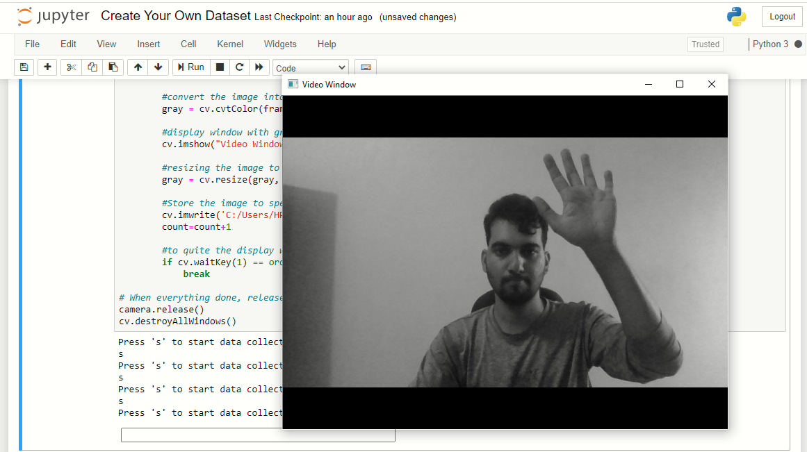

# OpenCV Kullanarak Python'da Kendi Verisetini Oluştur

Bu makalede sizlere kendi *taş, makas, kağıt* verisetinizi nasıl oluşturabilirsiniz onu göstereceğiz.

İlk önce sistemimiz üzerinde [Python3](https://www.python.org/downloads/) kurulu olması gerekiyor, eğer kurulu değilse link üzerinden kolayca indirip kurabilirsiniz. Bir sonraki kurulum ise **OpenCV** kurulumu olacaktır.

`pip install opencv-python=3`

*Burada **pip** yerine **pip3** de olabilir bazı sistemlerde.*

```python
import cv2 as cv
import os
```

Yukarıdaki kod parçası ile programımıza gerekli olan **OpenCV** modülünü ve sistem üzerinde işlem yapabilmemizi sağlayan **OS** modülünü eklemiş bulunuyoruz.

```python
kamera = cv.VideoCapture(0) # 0 ile default olan web kamerasını kullanıyoruz
if not kamera.isOpened():
    print("Kamera açılamadı, programdan çıkış yapılıyor.")
    exit()
```

Yukarıda bulunan kod parçası ile de sistemimizde bulunan ilk kamerayı program içinde tanımlıyoruz.

```python
labels ["null", "Taş", "Kağıt", "Makas"]
for label in labels:
    if not os.path.exists(label):
        os.mkdir(label)
```

Yukarıdaki kod parçası ile fotoğraflarımızın yerleşeceği klasörleri oluşturuyoruz.

```python
for folder in labels:
    counter = 0
    print("{folder} verisi toplamak için 's' tuşuna basınız.")
    usr_input = input()

    if usr_input != 's':
        print("s tuşuna basılmadı. Programdan çıkış yapılıyor.")
        exit()
    
    print("Kaç adet fotoğraf çekeceksiniz?")
    limit = int(input())
    while counter < limit:
        status, frame = kamera.read()
        if not status:
            print("Frame yakalanamadı, çıkış yapılıyor.")
            break
        gray = cv.cvtColor(frame, cv.COLOR_BGR2GRAY)
        cv.imshow("Gri skala", gray)

        gray = cv.resize(gray, (28, 28)) # daha az yer kaplaması ve daha kolay kullanılabilmesi için boyut küçültme işlemi gerçekleştiriyoruz.

        cv.imwrite('{folder}/img{counter}.png', gray)
        if cv.waitKey(1) == ord('q'):
            break

kamera.release()
cv.destroyAllWindows()
```

Yukarıdaki kod parçası ile de klasörlerimizin içerisini kameramız üzerinden çektiğimiz fotoğraflar ile dolduruyoruz.

## Uygulama





###### [Kaynak](https://www.analyticsvidhya.com/blog/2021/05/create-your-own-image-dataset-using-opencv-in-machine-learning/)
