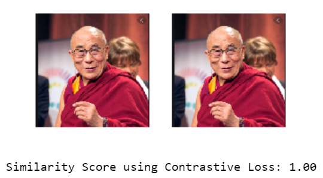
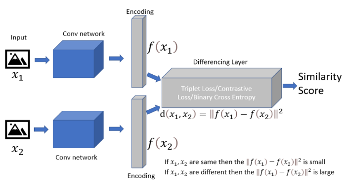
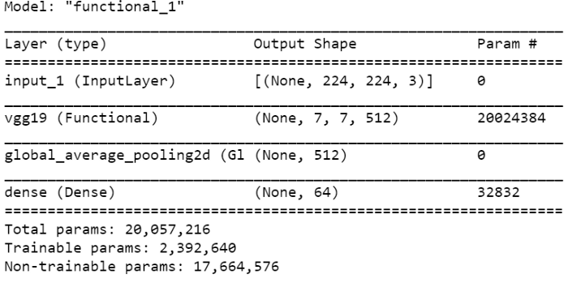
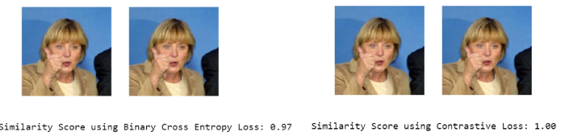
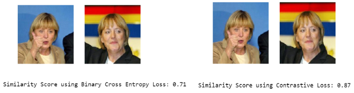
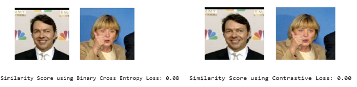

# Siamese Ağı ile Yüz Tanımlama

## Yüz Tanımlama

Yüz algılama, bir kişinin yüzünü videodan veya fotoğraftan tanımlama veya onaylama işlemidir.



*Siamese Network, 2 fotoğrafı aynı `Conv network`'e sokarak bu görsellerin aynı mı farklı mı olduğunu `One-shot classifier` ile bulur.



Görselde gözüken 2 `Conv network` **aynı yapıya, aynı hyperparameterlere ve aynı ağırlıklara** sahiptir.

Bu makalede tanımlama için *Binary cross-entropy* ve *Contrastive function general distance metrics to calculate the Similarity Score* kullanılacaktır.

## Diğer Siamese Network Uygulamaları

* Imza tanımlama
* Parmakizi kıyaslama
* Sağlık alanında hastalıkların algılanması
* Belirli iş için CV'lere göre eşleştirme
* Yazı - soru benzerlikleri algılama

## Siamese Network Eğitimi

### Siamese kardeş ağı oluşturma

Kardeş ağı oluştururken **transfer learning** methodu ile `VGG19` yapısını `encoder` için kullanılıcaktır.

```python3
def tf_siamese_nn(shape, embedding=64, fineTune=False):
    inputs = tf.keras.layers.Input(shape)
    preprocess_fn = preprocess_input
    base_model = tf.keras.applications.vgg19.VGG19(input_shape=shape, include_top=False,weights='imagenet')
    
    if fineTune==False:
        base_model.trainable=False
    else:
        base_model.trainable = True
        # Fine-tune from this layer onwards
        fine_tune_at = len(base_model.layers)-int(len(base_model.layers)*.10)
# Freeze all the layers before the `fine_tune_at` layer
        for layer in base_model.layers[:fine_tune_at]:
          layer.trainable =  False
    x=base_model(inputs)
    x=tf.keras.layers.GlobalAveragePooling2D()(x)
    outputs=tf.keras.layers.Dense(embedding)(x)
    model = tf.keras.Model(inputs, outputs)
    
    return model
model=tf_siamese_nn(IMG_SHAPE, 64, True)
model.summary()
```



### Euclidean Distance

Kardeş CNN network'lerinin çıktılarını kıyaslamak için `Euclidean Distance` fonksiyonumuz ile iki çıktı arasındaki farkları kıyaslayabiliriz.

```python3
def euclidean_distance(vectors):

    # unpack the vectors into separate lists
    (featsA, featsB) = vectors
    
    # compute the sum of squared distances between the vectors
    sumSquared = K.sum(K.square(featsA - featsB), axis=1,keepdims=True)
    
    # return the euclidean distance between the vectors
    return K.sqrt(K.maximum(sumSquared, K.epsilon()))
```

### Veri seti yükleme

Bu makale için [Labeled Faces in the Wild Home](http://vis-www.cs.umass.edu/lfw/#views) dataset'i kullanılacaktır. İçerisinde yaklaşık 1500'ye yakın farklı yüz bulunmaktadır.

### Pozitif ve Negatif veri eşleri oluşturma

Tüm görselleri dosya konumundan okuyup, preprocessing aşamalarını ve onu takip eden aşamaları gerçekleştirdikten sonra pozitif ve negatif veri olarak ayırma işlemini gerçekleştirmeliyiz.

**Positif veri eşi**: Birbirine benzeyen iki farklı görsel.

**Negatif veri eşi**: Birbirine benzemeyen iki farklı görsel.

```python3
def create_pairs(images, labels):
    # initialize two empty lists to hold the (image, image) pairs and
    # labels to indicate if a pair is positive or negative
    random.seed(2021)
    pairImages = []
    pairLabels = []
   
    # calculate the total number of classes present in the dataset
    # and then build a list of indexes for each class label that
    # provides the indexes for all examples with a given label
    numClasses = len(np.unique(y_val))
    classes=np.unique(y_val)
    idx = [np.where(y_val == classes[i]) for i in range(0, numClasses)]
    
    # loop over all images
    for idxA in range(len(images)):
        # grab the current image and label belonging to the current iteration
        currentImage = images[idxA]
        label = labels[idxA]
        
        # randomly pick an image that belongs to the *same* class
        # label
        posId = random.choice(list(np.where(labels == label)))
        posIdx =random.choice(posId)
        posImage = images[posIdx]
        
        # prepare a positive pair and update the images and labels
        pairImages.append([currentImage, posImage])
        pairLabels.append([1])
        
        # grab the indices for each of the class labels *not* equal to
        # the current label and randomly pick an image corresponding
        # to a label *not* equal to the current label
        negId = random.choice(list(np.where(labels != label)))         
        negIdx =random.choice(negId)
        negImage = images[negIdx]
        
        # prepare a negative pair of images and update our lists
        pairImages.append([currentImage, negImage])
        pairLabels.append([0])
   
    return (np.array(pairImages), np.array(pairLabels))
```

ve sonraki aşama olarak bu negatif ve pozitif veri eşlerini train ve test olarak ayırmamız gerekiyor.

```python3
(pairTrain, labelTrain) = create_pairs(x_train, y_train)
(pairTest, labelTest) = create_pairs(x_val, y_val)
```

### Siamese Network'ü oluşturma

```python3
img1 = tf.keras.layers.Input(shape=IMG_SHAPE)
img2 =  tf.keras.layers.Input( shape=IMG_SHAPE)
featureExtractor = tf_siamese_nn(IMG_SHAPE)
featsA = featureExtractor(img1)
featsB = featureExtractor(img2)
```

Aynı olan iki CNN networkünden çıkan `encoded` çıktılarını kıyaslamak için `Euclidean Distance` layer'ine sokarız ve devamında ise `Sigmoid` aktivasyon fonksiyonlu **Fully connected layer**'ı ekleyerek iki girdimizin çıktısını kontrol ederiz.

```python3
# finally, construct the siamese network
distance = tf.keras.layers.Lambda(euclidean_distance)([featsA, featsB])
outputs = tf.keras.layers.Dense(1, activation="sigmoid")(distance)
```

```python3
model = tf.keras.Model(inputs=[img1, img2], outputs=outputs)
```

## Compile the model

*Modelimizi `binary cross-entropy` veya `contrastive loss fonksiyonu` ile compile edebiliriz.*

**Binary Cross-entropy**

```python3
model.compile(loss="binary_crossentropy", optimizer="adam", metrics=["accuracy"])
# train the model
history = model.fit([pairTrain[:, 0], pairTrain[:, 1]], labelTrain[:], validation_data=([pairTest[:, 0], pairTest[:, 1]], labelTest[:]), batch_size=1, epochs=100)
```

**Contrastive Loss Fonksiyonu**

Bu fonksiyonun amacı farklı olan görsellerin *(veri eşleri)* değerini yüksek tutarken benzer olan görsellerin değerini en düşük seviyede tutmaktır.

```python3
def contrastive_loss(y, preds, margin=1):
 # explicitly cast the true class label data type to the predicted
 # class label data type 
 y = tf.cast(y, preds.dtype)
 # calculate the contrastive loss between the true labels and
 # the predicted labels
 squaredPreds = K.square(preds)
 squaredMargin = K.square(K.maximum(margin - preds, 0))
 loss = 1-K.mean(y * squaredPreds + (1 - y) * squaredMargin) 
 return loss

#%% Compile section

opt = tf.keras.optimizers.Adam(lr=0.001)
model.compile(loss=contrastive_loss, optimizer=opt,metrics=["accuracy"], )

history = model.fit([pairTrain[:, 0], pairTrain[:, 1]], labelTrain[:], validation_data=([pairTest[:, 0], pairTest[:, 1]], labelTest[:]),batch_size=1, epochs=120)
```

Şimdi aşağıdaki kod parçası ile eğitilmiş olan modelimizin performansını ölçebiliriz.

```python3
preds = model.predict( [valPairImages[file1_idx],valPairImages[ file2_idx]])
```

Modelimizin son katmanından dolayı çıktılarımız 0 ile 1 arasında olacaktır. 0 olan değer veri eşlerinin benzer olmadığı 1 ise veri eşlerinin benzer olduğu anlamına gelmektedir.

#### Aynı kişilerin modeldeki sonucu



#### Benzer kişilerin modeldeki sonucu



#### Farklı kişilerin modeldeki sonucu



###### [Orijinal Makale](https://medium.com/swlh/siamese-network-for-facial-recognition-5bd33be9e381)
