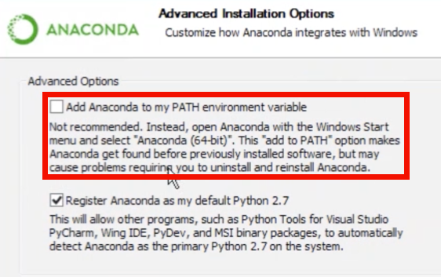
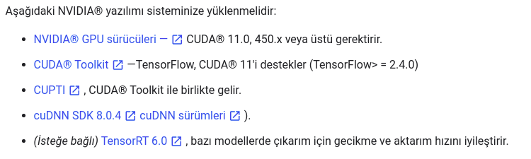
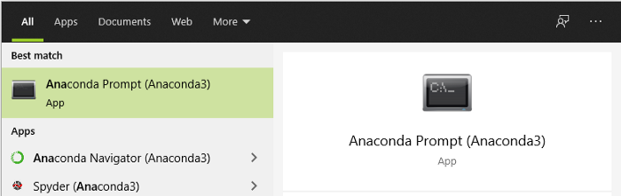

# Windows 10 - Tensorflow GPU Kurulumu


Tensorflow.org

Kuruluma geçmeden önce ekran kartınızın [**CUDA destekli kartların**](https://developer.nvidia.com/cuda-gpus) arasında yer aldığından emin olunuz.

## Gerekli Yazılımlar

Sıralı bir şekilde yüklediğinize emin olunuz.

1. **[Visual Studio](#visual-studio)**
2. **[Anaconda](#anaconda)** (*PiP'e alternatif olarak kolaylık sağlıyor.*)
3. **[NVIDIA CUDA Toolkit and cuDNN](#nvidia-cuda-toolkit-and-cudnn)**

### Visual Studio


visualstudio.microsoft.com

Not: Visual Studio Code ile Visual Studio'yu karıştırmayın. VS Code sadece bir IDE.

[Bu](https://visualstudio.microsoft.com/tr/) bağlantıya tıklayarak gideceğiniz microsoft sitesinden **Community** sürümünü indirip kurmanız gerekmektedir.

### Anaconda


anaconda.com

[Bu](https://www.anaconda.com/products/individual) bağlantıyı takip ederek anaconda'nın ücretsiz sürümünü indirebilirsiniz.

#### Not



Kurulum esnasında 'kırmızı' alanda bulunan seçeneği işaretlemek zorunda değilsiniz.

### NVIDIA CUDA Toolkit and cuDNN

Bu adımdan önceki yüklemeleri yaptıktan sonra bilgisayarınızı yeniden başlatmanızı isteyebilir.



Ocak 2021 tarihi için gereksinimler yukarıdaki gibidir. Siz de **[tensorflow](https://www.tensorflow.org/install/gpu)** sitesine giderek bu gereksinimleri olduğunuz tarih için kontrol edebilirsiniz.

* [CUDA resmi sitesine](https://developer.nvidia.com/cuda-toolkit-archive) giderek gerekli olan *CUDA Toolkit* dosyasını bilgisayarınıza indirmeniz ve kurmanız gerekmektedir.
* cuDNN şimdilik sadece kayıt ile indirilebiliyor. Eğer siz de merak ediyor ve indirmek istiyorsanız [bağlantıyı](https://developer.nvidia.com/cudnn) takip edip siteye gidebilirsiniz.

#### Önemli Not

Sisteminizde CUDA Toolkit'i kullanmak istiyorsanız, gerekli programların dosya yolunu sisteminize tanıtmalısınız. Örneğin; **CUDA Toolkit** `C:\Program Files\NVIDIA GPU Computing Toolkit\CUDA\v11.0` dizininde tanımlı ve **cuDNN** `C:\tools\cuda` dizininde tanımlıysa, `%PATH%`'inizi aşağıdaki gibi güncellemelisiniz.

```cmd
SET PATH=C:\Program Files\NVIDIA GPU Computing Toolkit\CUDA\v11.0\bin;%PATH%
SET PATH=C:\Program Files\NVIDIA GPU Computing Toolkit\CUDA\v11.0\extras\CUPTI\lib64;%PATH%
SET PATH=C:\Program Files\NVIDIA GPU Computing Toolkit\CUDA\v11.0\include;%PATH%
SET PATH=C:\tools\cuda\bin;%PATH%
```

## Environment'in Kurulumu



* Anaconda Prompt'u çalıştırınız.
* `conda create -n tf python=PYTHON_VERSION` komutu ile `tf` adında yeni bir environment oluşturunuz. (`PYTHON_VERSION` sizin belirlediğiniz Python versiyonudur)
* `conda activate tf` komutu ile yeni oluşturduğunuz `tf` environment'inize geçiş yapabilirsiniz.
* `pip install tensorflow` komutu ile *tensorflow* un en güncel sürümünü yükleyiniz.

Böylece `tf` environmentinizde sisteminizde yüklü olan GPU'yu aktif bir şekilde kullanabilirsiniz.

Eğer test etmek istiyorsanız, [bu link](../test_gpu_tf.py)'de bulunan dosyayı bilgisayarınızda çalıştırarak kontrol edebilirsiniz.

Karşılaştığınız sorunları **[Discussions bölümden](https://github.com/uysalserkan/ML-AI/discussions)** başlık açarak sorabilirsiniz.

##### [Orijinal Makale](https://towardsdatascience.com/setting-up-tensorflow-on-windows-gpu-492d1120414c)
